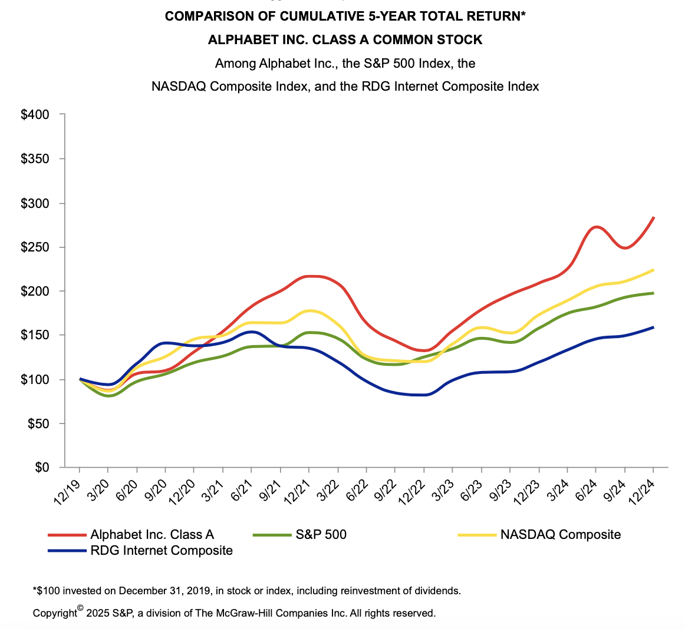
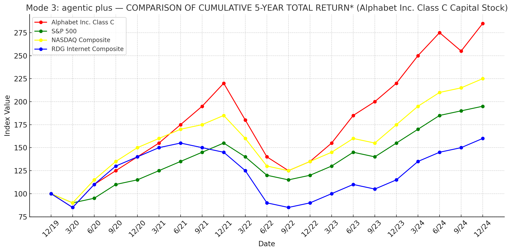
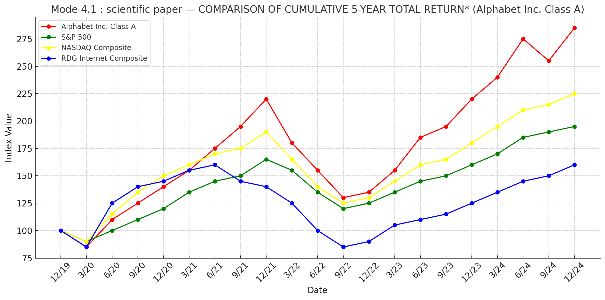
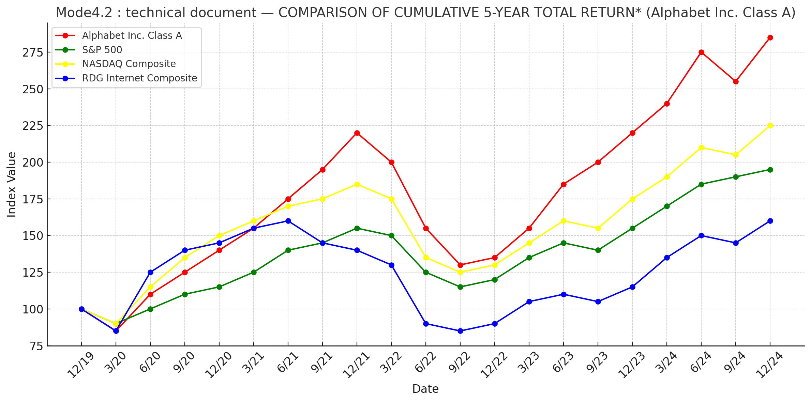

# LlamaCloud Parsing Review

## Document Used
- **Document**: Google 10-K (2024)  
- **Rationale**:  
  1. Sufficient length to evaluate **paragraph segmentation**  
  2. Rich in **figures and complex tables**, useful for stress testing  

- **Evaluation Focus**:  
  - **Markdown**: Formatting fidelity and data completeness
  - **JSON**: structural completeness for table reconstruction  

---

## Evaluation Criteria

### 1. Document Structure (Formatting Fidelity)
- **Order**: preservation of the original sequence  
- **Paragraph Chunking**: whether segmentation is natural and coherent  
- **Page Numbering**: keep pagination info  
- **Footnotes**: correct identification and alignment  

### 2. Data Fidelity
- **Completeness**: whether tables/graphs are preserved  
- **Numeric Accuracy**: correctness of values after parsing  
- **Graph Handling**: ability to interpret or convert figures  
- **Complex Tables**: nested headers and multi-level structures  

### 3. Output Format
| Format | Assessment |
|--------|------------|
| **Markdown** | Readability; support for tables, footnotes, headings |
| **JSON** | Structural metadata (columnGroups, unit, headerRow) and usability for direct table reconstruction |

---

## Mode Evaluation

### 1. Cost-effective

#### Document Structure
| Subcriteria | ✅/❌ | Comment |
|-------------|------|---------|
| Order | ✅ | Preserved |
| Paragraph Chunking | ✅ | Coherent segmentation |
| Page Numbering | ❌ | Partial loss of pagination |
| Footnotes | ❌ | Not recognized |

#### Data Fidelity
| Subcriteria | ✅/❌ | Comment |
|-------------|------|---------|
| Completeness | ❌ | Figures missing |
| Numeric Accuracy | ✅ | No major errors observed |
| Graph Handling | ❌ | Unable to parse |
| Complex Tables | ❌ | Nested headers not restored |

#### Output Format
| Format | Assessment |
|--------|------------|
| Markdown | Text only; tables/figures unsupported |
| JSON | Unusable: row misalignment, missing entries |

➡️ Evidence: [Appendix A1](./appendix/cost_effective.json)

---

### 2. Agentic

#### Document Structure
| Subcriteria | ✅/❌ | Comment |
|-------------|------|---------|
| Order | ✅ | Preserved |
| Paragraph Chunking | ✅ | Coherent |
| Page Numbering | ❌ | Pagination incomplete |
| Footnotes | ❌ | Not recognized |

#### Data Fidelity
| Subcriteria | ✅/❌ | Comment |
|-------------|------|---------|
| Completeness | ❌ | Missing headers; row shifts |
| Numeric Accuracy | ✅ | Values preserved |
| Graph Handling | ❌ | Converted to tables but inaccurate |
| Complex Tables | ❌ | Nested structures lost |

#### Output Format
| Format | Assessment |
|--------|------------|
| Markdown | Handles text and simple tables; poor for complex cases |
| JSON | Unusable: misaligned and incomplete |

➡️ Evidence: [Appendix A2](./appendix/agentic.json)

---

### 3. Agentic Plus

#### Document Structure
| Subcriteria | ✅/❌ | Comment |
|-------------|------|---------|
| Order | ✅ | Preserved |
| Paragraph Chunking | ✅ | Coherent |
| Page Numbering | ✅ | Complete |
| Footnotes | ✅ | Recognized |

#### Data Fidelity
| Subcriteria | ✅/❌ | Comment |
|-------------|------|---------|
| Completeness | ✅ | Text, tables, and figures captured |
| Numeric Accuracy | ✅ | Preserved |
| Graph Handling | ❌ | Converted to tables, but inaccurate |
| Complex Tables | ❌ | Nested headers not restored |

#### Output Format
| Format | Assessment |
|--------|------------|
| Markdown | Handles text/simple tables; weak for complex ones |
| JSON | Incomplete: missing important rows that have numerical data (e.g., “Total” row dropped) |

➡️ Evidence: [Appendix A3](./appendix/agentic_plus.json)

---

### 4. Use-case Presets

#### 4.1 Scientific Paper
| Subcriteria | ✅/❌ | Comment |
|-------------|------|---------|
| Order | ✅ | Preserved |
| Paragraph Chunking | ✅ | Natural |
| Page Numbering | ✅ | Complete |
| Footnotes | ✅ | Correctly parsed |

**Data Fidelity**  
- Completeness: ✅ Preserves text/tables/figures  
- Numeric Accuracy: ✅ Preserved  
- Graph Handling: ❌ Converted to tables; improved over Agentic Plus but missing legends  
- Complex Tables: ❌ Nested headers lost  

**Output Format**  
- Markdown: Handles text/simple tables; weak for complex tables  
- JSON: Retains most rows; some skipped  

➡️ Evidence: [Appendix A4](./appendix/scientific_paper.json)

---

#### 4.2 Technical Document
| Subcriteria | ✅/❌ | Comment |
|-------------|------|---------|
| Order | ✅ | Preserved |
| Paragraph Chunking | ✅ | Natural |
| Page Numbering | ✅ | Complete |
| Footnotes | ✅ | Correctly parsed |

**Data Fidelity**  
- Completeness: ✅ Preserves text/tables/figures  
- Numeric Accuracy: ✅ Preserved  
- Graph Handling: ❌ Converted; slightly better than scientific mode, includes legend  
- Complex Tables: ❌ Nested headers partially handled  

**Output Format**  
- Markdown: Can handle complex tables; graphs still weak  
- JSON: Retains more structure than other modes  

➡️ Evidence: [Appendix A5](./appendix/technical_document.json)

---

## Ability Summary

### Table Handling
| Mode | Simple Table | Complex Table: Completeness | Complex Table: Format |
|------|--------------|-----------------------------|-----------------------|
| Cost-effective | ✅ | ❌ | ❌ |
| Agentic | ✅ | Medium | ❌ |
| Agentic Plus | ✅ | ❌ | ❌ |
| Use-case (Scientific Paper) | ✅ | ❌ | Medium |
| Use-case (Technical Document) | ✅ | Medium | Medium |

**Ranking**: Technical Document > Scientific Paper > Agentic >> Agentic Plus > Cost-effective  

### Graph Handling
| Mode | Graph Parsing |
|------|---------------|
| Cost-effective | ❌ Ignored |
| Agentic | ❌ Inaccurate conversion with missing data |
| Agentic Plus | ❌ Conversion with missing accuracy |
| Scientific Paper | ❌ Better accuracy; legend missing |
| Technical Document | ❌ Similar to scientific; legend preserved |

**Ranking**: Technical Document > Scientific Paper > Agentic Plus >> Agentic >>> Cost-effective  

**Examples**  

- Original Graph (Google 10-K)  
    

- Agentic Plus (Mode 3)  
    

- Scientific Paper (Mode 4.1)  
    

- Technical Document (Mode 4.2)  
    

---

## Demand vs. Mode Matrix
| Requirement \ Mode | Cost-effective | Agentic | Agentic Plus | Scientific Paper | Technical Document |
|--------------------|----------------|---------|--------------|------------------|-------------------|
| Text | ✅ | ✅ | ✅ | ✅ | ✅ |
| Simple Table | ✅ | ✅ | ✅ | ✅ | ✅ |
| Complex Table | ❌ | ❌ | ❌ | Medium | Medium |
| Graph | ❌ | ❌ | ❌ | Medium | Medium |

---

## Observations
1. Matching between parsed output and original source is difficult; **auto-alignment tools** would be highly valuable.  
2. JSON view in the UI is **laggy and hard to operate**, reducing usability.  

---

## Appendix
The full evidence files (JSON, Markdown outputs, and screenshots) are still being organized and will be uploaded progressively.